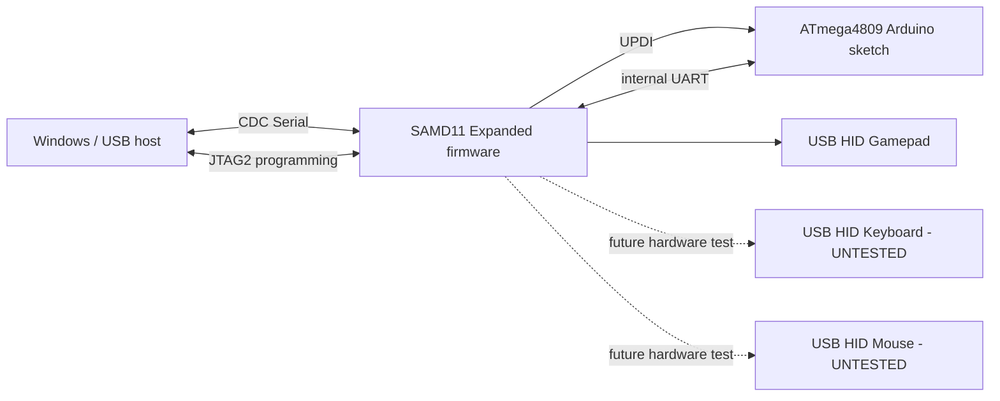

# Nano Every Expanded USB

> **Experimental / early hardware release**  
> **HID test status:** the **gamepad path is the only HID function currently verified on real hardware**. Keyboard and mouse support exists in the firmware, but those paths are **not yet hardware-tested** and should not be described as working until their test reports are added here.

**Nano Every Expanded USB** is an unofficial community project that explores using the Arduino Nano Every's onboard **ATSAMD11D14AM** as a more capable USB coprocessor while preserving the normal ATmega4809 Arduino workflow.

Project by **BlaX / Xalbz**.

## Current status

The first successful hardware milestone was reached on **2026-09-14**.

What we have actually demonstrated on the development board:

- ✅ Expanded SAMD11 firmware boots and enumerates.
- ✅ **USB HID gamepad** enumerates and sends live button/axis reports.
- ✅ CDC serial remains usable after the EP0 repair.
- ✅ The 1200-baud programming trigger still works.
- ✅ JTAG2/UPDI programming of the ATmega4809 still works.
- ✅ A normal `.ino` sketch can be uploaded from Arduino IDE while Expanded remains installed.
- ⏳ USB keyboard: code path present, **not hardware-tested yet**.
- ⏳ USB mouse: code path present, **not hardware-tested yet**.

**Important:** CDC and Arduino IDE upload tests verify the supporting USB/programming infrastructure. They do **not** count as validation of keyboard or mouse HID behavior.

As development continues, each newly tested function will get its own result in [docs/TEST_MATRIX.md](docs/TEST_MATRIX.md) and, where useful, a dedicated test sketch/log.

## v0.1.0 package

The preserved Windows v5 repair/build package used for this milestone is published here:

**[NanoEvery_CDC_Repair_v5_EP0_StringFix.zip](release/v0.1.0/NanoEvery_CDC_Repair_v5_EP0_StringFix.zip)**

Package SHA-256:

```text
41519adbabc6218c8d6f3ad03679d3fd63c88a9a770881dad1292780fdf338fe
```

Checksums and the hardware-tested local firmware hash are recorded in [release/v0.1.0/SHA256SUMS.txt](release/v0.1.0/SHA256SUMS.txt).

The package is intentionally preserved in its hardware-tested form. A cleaner repo-relative installer can be developed later without losing the known-good reference workflow. See [tools/README.md](tools/README.md).

## Architecture

The Nano Every contains two MCUs:

- **ATmega4809** — runs the Arduino sketch.
- **ATSAMD11D14AM** — handles USB and programming.

Expanded keeps this two-MCU design:



The key design goal is to gain extra USB capability **without throwing away normal Nano Every sketch uploading**.

## Hardware-tested firmware snapshot

The v5 EP0 repair image used in the successful gamepad/programming test measured:

```text
12,208 / 12,288 bytes
80 bytes free
```

SHA-256:

```text
a504f33ecf0e985efda9eff4813cf823ffb52de69c5a3abd907071df3247e28e
```

See [Hardware verification](docs/HARDWARE_VERIFICATION.md).

## Why v5 mattered: the CDC / EP0 bug

During development, Windows could enumerate the Expanded CDC interface and then later hang while reading serial-port state. USB tracing showed that Windows requested a string descriptor with `wLength = 0x0100` (256), while the pinned historical SAMD core passed the request into a helper whose `maxlen` parameter was only 8-bit:

```cpp
sendStringDescriptor(const uint8_t *string, uint8_t maxlen)
```

That narrowed `256` to `0`, broke the control request, and poisoned endpoint 0 for later CDC requests.

v5 widens that descriptor-length path and safely caps the temporary descriptor size. Full notes are in [docs/USB_TRACE_DIAGNOSIS.md](docs/USB_TRACE_DIAGNOSIS.md).

## What you can test today

### 1. Gamepad — verified

The safe first HID test intentionally uses **gamepad only**, avoiding accidental keyboard presses or mouse movement.

See:

```text
examples/NanoEvery_NanoUSB_GamepadTest/
```

The verified test toggles gamepad Button 1 and moves an axis so the complete path can be observed in Windows (`joy.cpl`).

### 2. Normal Arduino IDE upload — verified infrastructure

See:

```text
examples/IDE_Upload_Verification/IDE_Upload_Verification.ino
```

Upload it normally as **Arduino Nano Every**, then open Serial Monitor at **115200 baud**. A successful run prints:

```text
BLAX NANO EVERY EXPANDED
ARDUINO IDE UPLOAD TEST
Firmware ID : BLAX_EXPANDED_IDE_TEST_V1
Upload      : SUCCESS
ATmega4809  : RUNNING
CDC Serial  : RUNNING
LIVE | seconds=1 | packet=0
LIVE | seconds=2 | packet=1
...
```

Sending `P` should return:

```text
PONG - USB CDC RX/TX VERIFIED!
```

This test proves the normal sketch/programming path remains usable. It does **not** validate keyboard or mouse HID.

## Test policy

This repository intentionally distinguishes three states:

| Label | Meaning |
|---|---|
| ✅ **Hardware verified** | Seen working on a physical Nano Every during a controlled test |
| 🧪 **Ready for test** | Implemented/buildable, but not yet physically validated |
| 🧩 **Planned** | Design/work remains |

No feature should move to **Hardware verified** until we actually test it and record the result.

Current detailed matrix: [docs/TEST_MATRIX.md](docs/TEST_MATRIX.md).

## Flashing safety

This project modifies the **SAMD11 application region**. A broken image can make normal USB disappear until recovery.

Before flashing anything:

1. Read [docs/RECOVERY.md](docs/RECOVERY.md).
2. Make and keep **your own** original SAMD11 application backup.
3. Preserve the lower 4 KB SAM-BA recovery bootloader.
4. Do not use a full-chip erase as a normal flashing/recovery step.
5. Reject application images larger than **12,288 bytes**.
6. Verify the target before writing (`ATSAMD11D14AM`, chip ID `0x10030000` on the tested board).

You are modifying USB firmware at your own risk.

## ATmega4809 ↔ SAMD11 HID protocol

The experimental HID channel uses the Nano Every's internal `Serial` UART at 115200 baud:

```text
A5 5A C3 3C CMD LEN PAYLOAD... CRC
```

The protocol already defines keyboard, mouse and gamepad commands, but **only gamepad has completed physical HID validation so far**.

See [docs/PROTOCOL.md](docs/PROTOCOL.md).

## Contributing / test reports

Hardware testing is especially useful. If you test another Nano Every, Windows machine, keyboard path, mouse path, or another host OS, please record the exact board, firmware hash, OS, steps and result.

See [CONTRIBUTING.md](CONTRIBUTING.md) and the hardware-test issue template.

## Credits

This project builds on Arduino's Nano Every / MuxTO and SAMD/megaAVR core work, plus historical MattairTech SAMD11/BOSSA tooling used to reconstruct the build/recovery environment. See [NOTICE.md](NOTICE.md).

This is **not an official Arduino project** and is not endorsed by Arduino.
